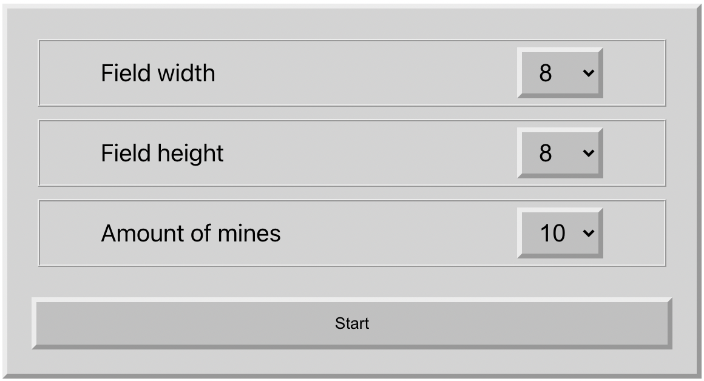
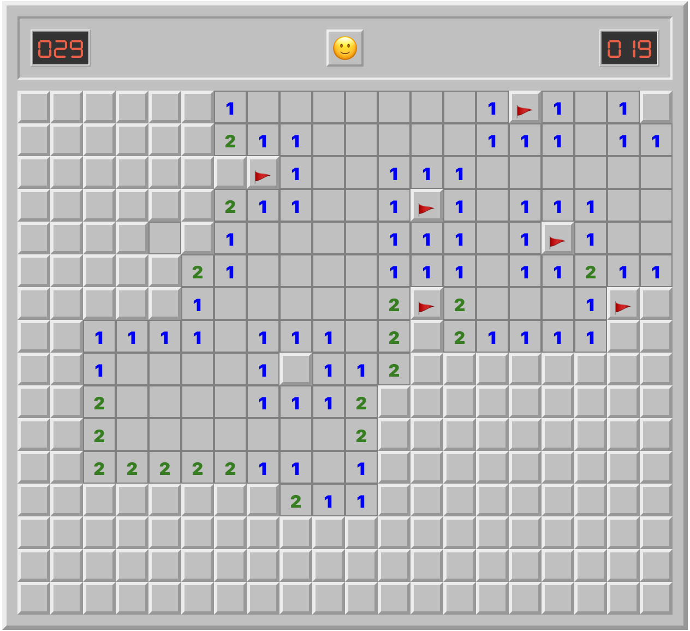

<h2> Minesweeper React<h2>

---
Classic single-player logic based game. Players goal is to locate all randomly placed mines in game field.

In the setting screen the player can choose the width and height of the field, and the number of mines placed.

Game starts after player opens or marks one of cell.

Settings screen:

Game:

