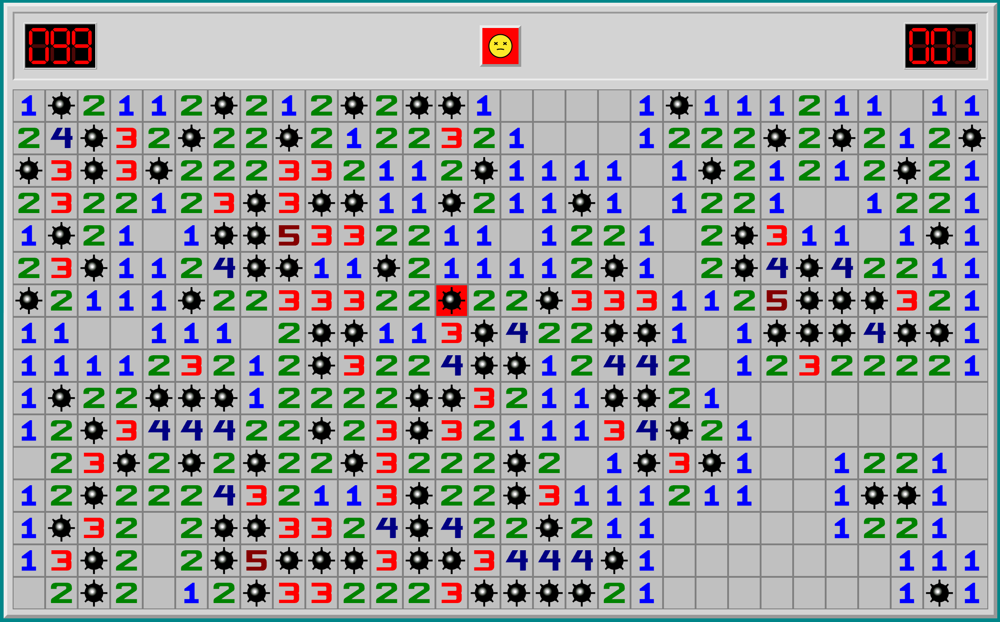
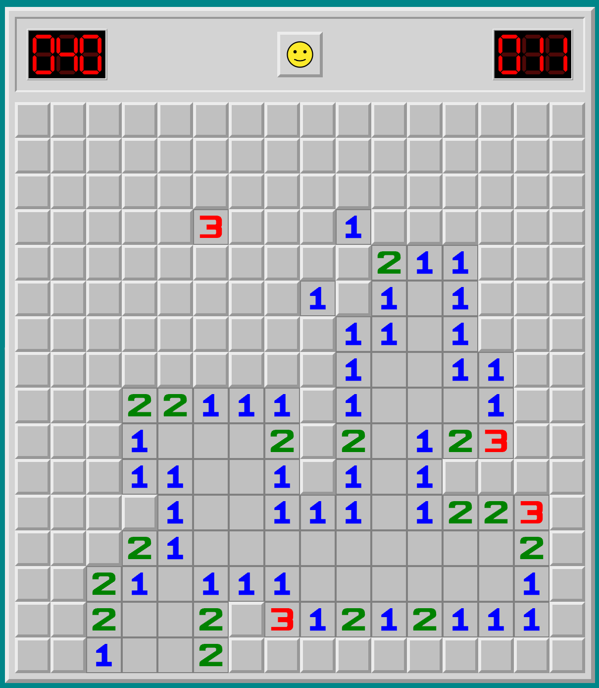

# [Minesweeper.react](https://minesweeper-lac-five.vercel.app/settings)

Minesweeper is classic single-player logic based game.
 
Players goal is to locate all randomly placed mines in game field.
---

## Game difficulty options:
- **Beginner** ( 9 x 9 cell board and 10 mines )
- **Intermediate** ( 16 x 16 cell board and 40 mines )
- **Expert** ( 30 x 16 cell board and 99 mines )
- **Advanced** ( custom board size and mine amount )
---

## Screenshots:

 

---
## Changelog:
### 2023-04:
> - Refactored game UI
> - Added predefined game settings
> - Game logic bug fixes